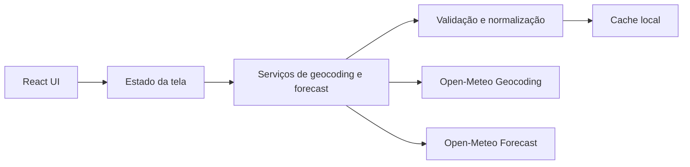
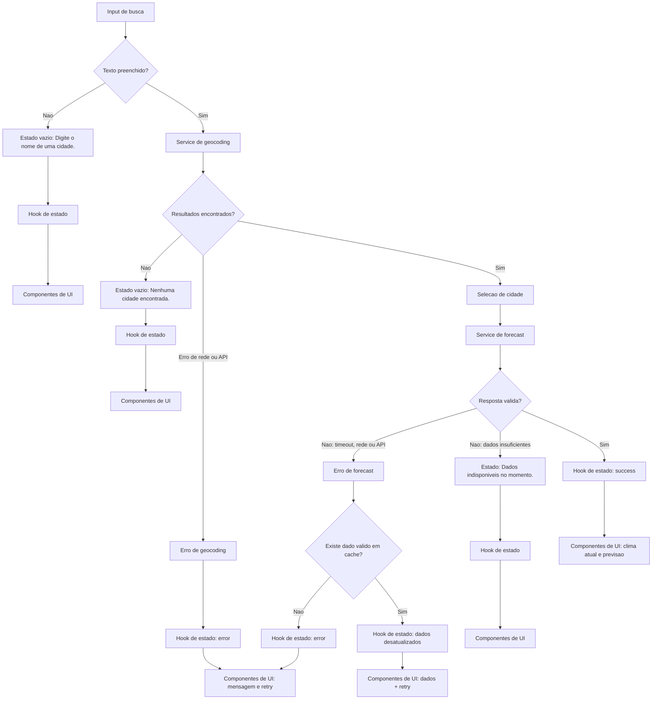

# Plano Técnico — Weather App

Este plano deriva de `specs/weather-app-spec.md` e orienta a implementação do
MVP. Ele define arquitetura, decisões técnicas e contratos entre camadas, mas
não contém o código final da aplicação.

## Architecture

A aplicação será uma SPA React estática, organizada em camadas pequenas e com
responsabilidades explícitas. A dependência flui da apresentação para a
orquestração, e desta para acesso a dados e funções puras, sem chamadas de API
diretas na interface:



- **Apresentação (`components/`):** busca, seleção de cidade, clima atual,
  previsão, unidade e feedback de estado. Recebe dados e callbacks por props;
  não acessa APIs, cache ou `localStorage` diretamente. O estilo seguirá
  Tailwind com o tema dark glassmorphism definido pelo projeto, preservando
  contraste, foco visível e leitura em telas pequenas.
- **Orquestração e estado (`hooks/`):** coordena ações do usuário, estados de
  loading/erro/sucesso, cidade selecionada, retry, cache e unidade. É a única
  camada que combina componentes, serviços e funções puras.
- **Acesso a dados (`services/`):** encapsula `fetch`, timeout, URLs,
  normalização de respostas externas e persistência do cache. Não renderiza UI
  nem decide como as mensagens serão apresentadas.
- **Funções puras (`lib/`):** concentra conversão de temperatura, validação,
  formatação de datas e mapeamento de códigos meteorológicos. Não depende de
  React, rede ou armazenamento do navegador.
- **Tipos (`types/`):** define os contratos compartilhados entre as camadas e
  não contém comportamento de execução.

Essa separação permite trocar a UI sem reescrever a integração, testar o fluxo
de estado com serviços simulados e testar regras meteorológicas determinísticas
sem navegador ou rede.

O fluxo será orientado a ações explícitas. Não haverá polling, refresh
automático, backend próprio, autenticação ou estado global adicional.

## Tech Stack

- **TypeScript strict:** contratos compartilhados e validação estática entre
  serviços, estado e componentes.
- **React 19 + React DOM:** composição da SPA e estado local da experiência.
- **Vite:** desenvolvimento e build de uma aplicação estática.
- **Tailwind CSS:** estilos responsivos, mobile-first e consistentes com o
  tema definido pelo projeto.
- **Open-Meteo:** geocoding e forecast sem chave de API, conforme RF01, RF03 e
  RNF07.
- **`fetch` nativo:** dependência mínima para chamadas HTTPS e controle de
  `AbortController`/timeout.
- **`localStorage`:** preferência de unidade e cache meteorológico local.
- **Vitest + Testing Library:** lógica pura, serviços e estados da UI.
- **Playwright:** fluxos completos, responsividade e cenários de resiliência.
- **Biome:** lint e formatação já configurados no projeto.
- **Compatibilidade:** a implementação seguirá HTML semântico e APIs web
  disponíveis nas versões atuais de Chrome, Firefox, Safari e Edge.

Não será introduzida uma biblioteca de gerenciamento global, cliente HTTP ou
camada de cache externa: o escopo não justifica esse custo.

## Project Structure

```text
src/
  components/
    SearchForm.tsx
    CityResults.tsx
    CurrentWeather.tsx
    ForecastList.tsx
    RefreshButton.tsx
    UnitToggle.tsx
    StatusMessage.tsx
  hooks/
    useWeatherApp.ts
  services/
    geocodingService.ts
    weatherService.ts
    cacheService.ts
  types/
    weather.ts
    api.ts
  lib/
    temperature.ts
    date.ts
    weatherCode.ts
    validation.ts
  App.tsx
  main.tsx
```

- `components/` contém um componente de interface por arquivo e não realiza
  chamadas diretas à API.
- `hooks/` coordena ações e estado da tela, mantendo componentes de
  apresentação mais simples.
- `services/` concentra integração externa e persistência local.
- `types/` contém contratos internos e tipos mínimos das respostas externas.
- `lib/` contém funções puras para conversão, datas, códigos meteorológicos e
  validações.

Os nomes são uma proposta de organização; tarefas futuras podem agrupar
componentes pequenos caso isso reduza complexidade sem misturar camadas. Antes
de qualquer implementação, esta estrutura será quebrada em tarefas conforme o
fluxo SDD do projeto.

## Data Model

Os dados meteorológicos internos serão mantidos em Celsius e em unidades
originais da API. A apresentação converte apenas no último momento.

```ts
type Unit = 'celsius' | 'fahrenheit';

interface City {
  id: number; // Identificador da cidade retornado pelo geocoding.
  name: string; // Nome da cidade.
  country: string; // Nome do país.
  countryCode?: string; // Código ISO do país, quando disponível.
  region?: string; // Estado ou região administrativa (`admin1`).
  latitude: number; // Latitude usada na consulta meteorológica.
  longitude: number; // Longitude usada na consulta meteorológica.
  timezone?: string; // Fuso horário retornado pelo geocoding.
}

interface CurrentWeather {
  time?: string; // Horário da observação em `timezone=auto`.
  temperatureC?: number; // `temperature_2m`, sempre normalizada para Celsius.
  apparentTemperatureC?: number; // `apparent_temperature`, em Celsius.
  humidityPercent?: number; // `relative_humidity_2m`, em percentual.
  windSpeedKmh?: number; // `wind_speed_10m`, normalizada para km/h.
  weatherCode?: number; // `weather_code` WMO para condição e ícone.
}

interface ForecastDay {
  date: string; // Data local do dia no fuso da cidade.
  minTemperatureC?: number; // `temperature_2m_min`, em Celsius.
  maxTemperatureC?: number; // `temperature_2m_max`, em Celsius.
  weatherCode?: number; // `weather_code` diário WMO.
}

interface WeatherData {
  city: City; // Cidade associada às coordenadas consultadas.
  timezone: string; // Fuso retornado pela API para formatar datas e horários.
  current: CurrentWeather; // Condições meteorológicas atuais.
  forecast: ForecastDay[]; // Previsão normalizada para exatamente cinco dias.
  fetchedAt: string; // Instante ISO de recebimento da resposta.
}

interface CachedWeather {
  data: WeatherData; // Última resposta meteorológica válida.
  cachedAt: string; // Instante usado para validar a expiração do cache.
}
```

Contratos de operação:

```ts
interface SearchState {
  query: string;
  results: City[];
  status: 'idle' | 'loading' | 'success' | 'empty' | 'error';
  errorMessage?: string;
}

interface WeatherState {
  selectedCity?: City;
  data?: WeatherData;
  status: 'idle' | 'loading' | 'success' | 'error' | 'unavailable';
  isStale: boolean;
  errorMessage?: string;
}
```

`forecast` deverá conter exatamente cinco itens após a normalização. Campos
opcionais ausentes serão renderizados como `—`, sem inventar valores.

## Data Flow



1. O usuário envia o formulário; o hook valida `trim()` e rejeita entrada vazia
   com `Digite o nome de uma cidade.` sem chamar a API.
2. O estado de busca passa a `loading`, limpa resultados anteriores e o serviço
   consulta o endpoint de geocoding.
3. A resposta é validada e normalizada em `City[]`. Lista vazia produz o estado
   `empty` e `Nenhuma cidade encontrada.`.
4. Ao selecionar uma cidade, o estado salva o contexto atual, limpa dados de
   outra cidade e inicia a consulta meteorológica pelas coordenadas.
5. O serviço consulta o forecast, normaliza a resposta e limita a previsão aos
   cinco primeiros dias válidos, usando o timezone retornado pela API.
6. Uma resposta válida atualiza a tela e o cache. A UI calcula os rótulos de
   condição a partir de `weatherCode` e formata datas no fuso da cidade.
7. A alternância de unidade altera apenas a preferência e a apresentação dos
   valores; não reexecuta o fluxo de rede.
8. Uma atualização manual repete a consulta da cidade selecionada. Falhando a
  nova consulta, o último `WeatherData` válido permanece visível e `isStale` fica
   `true`.

## External APIs

### Geocoding

Endpoint: `GET https://geocoding-api.open-meteo.com/v1/search`

Parâmetros relevantes:

- `name`: termo de busca já normalizado e codificado para URL.
- `count=10`: limite pequeno de resultados para seleção manual e cidades
  homônimas.
- `language=pt`: prioriza nomes compreensíveis para o público pt-BR.
- `format=json`: solicita resposta JSON.

Exemplo resumido de resposta:

```json
{
  "results": [
    {
      "id": 3448439,
      "name": "Sao Paulo",
      "latitude": -23.55,
      "longitude": -46.63,
      "timezone": "America/Sao_Paulo",
      "country": "Brazil",
      "country_code": "BR",
      "admin1": "Sao Paulo"
    }
  ]
}
```

Mapeamento para `City`:

- `id` -> `City.id`;
- `name` -> `City.name`;
- `country` -> `City.country`;
- `country_code` -> `City.countryCode`;
- `admin1` -> `City.region`;
- `latitude` e `longitude` -> coordenadas homônimas;
- `timezone` -> `City.timezone`.

Se `results` não existir ou estiver vazio, a busca produz `City[]` vazio e o
estado `Nenhuma cidade encontrada.`. Campos opcionais ausentes não invalidam o
resultado, mas `id`, nome e coordenadas são necessários para selecionar uma
cidade e consultar o forecast.

### Forecast

Endpoint: `GET https://api.open-meteo.com/v1/forecast`

Parâmetros relevantes:

- `latitude` e `longitude` da cidade selecionada.
- `current=temperature_2m,apparent_temperature,relative_humidity_2m,wind_speed_10m,weather_code` para as condições atuais.
- `daily=weather_code,temperature_2m_max,temperature_2m_min` para os cinco dias.
- `forecast_days=5` para incluir o dia atual e os quatro seguintes.
- `temperature_unit=celsius` e `wind_speed_unit=kmh` para manter um modelo
  interno estável e converter somente na apresentação.
- `timezone=auto`.

Exemplo resumido de resposta:

```json
{
  "timezone": "America/Sao_Paulo",
  "current": {
    "time": "2026-09-16T10:00",
    "temperature_2m": 22.4,
    "apparent_temperature": 22.1,
    "relative_humidity_2m": 68,
    "wind_speed_10m": 12.5,
    "weather_code": 2
  },
  "daily": {
    "time": ["2026-09-16", "2026-09-17"],
    "temperature_2m_min": [16.2, 17.0],
    "temperature_2m_max": [25.8, 27.1],
    "weather_code": [2, 61]
  }
}
```

Mapeamento para `WeatherData`:

- O `City` selecionado é anexado como `WeatherData.city`.
- `timezone` -> `WeatherData.timezone`; o valor também orienta a formatação de
  datas e horas.
- `current.time` -> `CurrentWeather.time`;
- `current.temperature_2m` -> `CurrentWeather.temperatureC`;
- `current.apparent_temperature` -> `CurrentWeather.apparentTemperatureC`;
- `current.relative_humidity_2m` -> `CurrentWeather.humidityPercent`;
- `current.wind_speed_10m` -> `CurrentWeather.windSpeedKmh`;
- `current.weather_code` -> `CurrentWeather.weatherCode`;
- Para cada índice `i` de `daily.time`, criar um `ForecastDay` com `time[i]` em
  `date`, `temperature_2m_min[i]` em `minTemperatureC`,
  `temperature_2m_max[i]` em `maxTemperatureC` e `weather_code[i]` em
  `weatherCode`;
- `new Date().toISOString()` no recebimento -> `WeatherData.fetchedAt`.

O normalizador deve exigir `timezone`, `current` e as três séries diárias; deve
alinhar os arrays pelo mesmo índice. Campos complementares ausentes em
`current` são aceitos como `undefined`, conforme AC03. Já um item diário sem
data, mínima, máxima ou condição não é um dia válido; para cumprir AC04, a
resposta só será considerada completa quando resultar em exatamente cinco
`ForecastDay`. Caso contrário, a UI exibirá `Dados indisponíveis no momento.`.

O cliente deve exigir HTTPS, verificar `response.ok`, validar JSON e rejeitar
respostas incompatíveis com o contrato. Cada chamada usará `AbortController`
com timeout de 10 segundos; esse limite será coberto por teste e poderá ser
alterado posteriormente por configuração, sem mudar o contrato dos serviços.

## State Management

O estado ficará centralizado no hook `useWeatherApp`, consumido por `App` e
passado aos componentes por props. Não haverá store global: a tela é uma única
experiência e o hook mantém as transições em um só lugar. O hook terá ações
explícitas para:

- `searchCity(query)`;
- `selectCity(city)`;
- `refreshWeather()`;
- `setTemperatureUnit(unit)`.

O estado será dividido em busca, clima e preferência de apresentação:

```ts
interface AppState {
  search: SearchState; // Resultados e estado da última busca.
  weather: WeatherState; // Cidade, dados meteorológicos e falhas do forecast.
  unit: Unit; // Unidade escolhida para a apresentação.
}
```

Estados explícitos:

- `idle`: nenhuma operação está em andamento; inclui a tela inicial sem cidade
  selecionada.
- `loading`: a busca ou consulta meteorológica está em andamento; a UI mostra
  spinner e `Carregando…`.
- `success`: a operação terminou com dados válidos; a UI renderiza resultados
  ou clima, conforme a operação.
- `empty`: a busca terminou sem cidades; a UI mostra `Nenhuma cidade
  encontrada.` e não renderiza clima anterior como resultado da busca.
- `error`: a operação falhou por rede, HTTP, timeout ou resposta inválida; a UI
  mostra a mensagem padronizada e uma ação de retry.

O estado `unavailable` do clima será usado apenas para uma resposta sem dados
renderizáveis, com `Dados indisponíveis no momento.`. Ele é uma especialização
de erro de conteúdo e não substitui os estados obrigatórios acima.

Transições principais:

| Ação | Estado inicial | Estado final |
| --- | --- | --- |
| Abrir a aplicação | nenhum | `idle` |
| Buscar texto válido | `idle` ou qualquer estado de busca | `loading` -> `success` ou `empty`/`error` |
| Buscar texto vazio | qualquer | `error` de validação, sem request |
| Selecionar cidade | resultados disponíveis | `loading` -> `success` ou `error`/`unavailable` |
| Atualizar clima | `success` ou dados em cache | `loading` -> `success` ou `error` com dados preservados |
| Tentar novamente | `error` | `loading` -> `success` ou `empty`/`error` |

Durante uma nova consulta meteorológica, o último `WeatherData` válido pode
continuar visível. Se a consulta falhar, ele permanece na tela com `isStale` em
`true`; sem dados anteriores, a tela exibe somente o erro.

### Conversão de unidade

O estado meteorológico sempre armazena temperaturas em Celsius, conforme o
contrato de `WeatherData`. `unit` é apenas preferência de apresentação e será
persistida em `localStorage`. A conversão ocorrerá durante a renderização, por
uma função pura de `lib/temperature.ts`, sem alterar `WeatherData` e sem novo
request:

```ts
function toDisplayTemperature(valueC: number | undefined, unit: Unit): number | undefined {
  if (valueC === undefined) return undefined;
  return unit === 'fahrenheit' ? (valueC * 9) / 5 + 32 : valueC;
}
```

O componente formata o resultado com uma casa decimal consistente e acrescenta
`°C` ou `°F`. A mesma função será usada para temperatura atual, sensação
térmica, mínima e máxima. Alternar `unit` causa apenas nova renderização; não
modifica o dado bruto, não invalida o cache e não chama a Open-Meteo.

A unidade inicial é Celsius. A inicialização lê `localStorage` com validação e
usa Celsius para valores ausentes ou inválidos.

Não haverá atualização automática nem polling. A recarga manual da página é um
gatilho permitido pelo RF09, mas a v1 não persistirá a cidade selecionada; por
isso, após uma recarga a tela inicia em `idle` e não dispara request sem uma
nova busca/seleção explícita. A preferência de unidade será reconstruída do
`localStorage`; o cache poderá ser usado como fallback somente quando existir
uma entrada válida para a cidade selecionada durante uma atualização manual ou
uma nova consulta. Assim, o cache continua útil após recarregar a página e
selecionar novamente a cidade, sem persistir automaticamente o contexto da
cidade nem criar uma consulta de inicialização.

## Error Handling

Os serviços convertem falhas externas em um erro interno com categoria, sem
expor detalhes técnicos diretamente na UI:

```ts
type WeatherErrorKind = 'network' | 'api' | 'timeout' | 'invalid-response';

interface WeatherError {
  kind: WeatherErrorKind;
  message: string;
  statusCode?: number;
}
```

Estados visíveis e contratos de mensagem:

| Situação | Estado e comportamento |
| --- | --- |
| Sem cidade selecionada | Instrução para buscar uma cidade antes do clima. |
| Busca em andamento | Spinner e `Carregando…`; controles permanecem acessíveis quando possível. |
| Consulta meteorológica em andamento | Spinner e `Carregando…`; atualização manual não cria consultas concorrentes. |
| Busca vazia | `Digite o nome de uma cidade.` sem requisição. |
| Busca sem resultado | `Nenhuma cidade encontrada.` sem dados meteorológicos anteriores. |
| API/rede/timeout | `Não foi possível carregar os dados do clima.` e ação explícita de tentar novamente. |
| Resposta válida sem conteúdo | `Dados indisponíveis no momento.` mantendo a UI funcional. |
| Falha com cache válido | Mantém o `WeatherData`, mostra `Dados desatualizados` e permite tentar novamente. |
| Campo opcional ausente | Renderiza `—` somente para o campo afetado. |

- **Rede:** rejeição do `fetch`, ausência de conexão ou falha de DNS produz
  `kind: network`, preserva dados válidos anteriores e oferece retry.
- **API/HTTP:** resposta não-`2xx` produz `kind: api` e registra o status; o
  comportamento de tela é o mesmo de erro recuperável, com fallback para cache.
- **Timeout:** `AbortController` identifica a expiração do limite e produz
  `kind: timeout`; não haverá retry automático, apenas ação explícita do
  usuário.
- **Resposta parcial ou inválida:** JSON malformado, campos estruturais
  ausentes, arrays diários desalinhados ou menos de cinco dias produzem
  `kind: invalid-response`. Campos meteorológicos opcionais ausentes, porém,
  não invalidam a resposta: são mapeados como `undefined` e renderizados como
  `—`, desde que a estrutura necessária permaneça válida.

Em todos os casos, a UI permanece operável. Uma falha durante atualização não
substitui a última resposta válida; ela marca `isStale` e mostra `Dados
desatualizados`. Sem resposta anterior ou cache válido, mostra a mensagem de
erro e o retry. O cache só é aceito quando seu formato e `cachedAt` são válidos
e têm no máximo 30 minutos; dados corrompidos ou expirados são descartados.

As chaves de armazenamento serão estáveis e específicas: `weather-unit` para a
unidade preferida e `weather-cache:<city.id>` para o cache meteorológico. Uma
consulta bem-sucedida substitui a entrada da cidade; não haverá histórico de
cidades nem limpeza global além da substituição ou expiração dessas entradas.

Erros técnicos serão registrados em logs de diagnóstico com origem, duração da
chamada e código HTTP quando disponível, sem URL completa, consulta completa ou
dados pessoais desnecessários.

## Testing Strategy

### Vitest

Vitest será a camada rápida de testes unitários e de integração isolada. As
dependências externas serão substituídas por doubles determinísticos, para que
os testes não dependam da disponibilidade ou do conteúdo atual da Open-Meteo.

- **Funções puras (`lib/`):** cobrir fórmulas Celsius/Fahrenheit nos dois
  sentidos, arredondamento e uma casa decimal, valor ausente como `undefined`,
  formatação de datas no timezone da cidade, mapeamento de `weatherCode` e
  validação de entrada. Esses testes não usam mocks de rede, React ou DOM.
- **Services:** mockar `globalThis.fetch` para cobrir resposta válida de
  geocoding e forecast, erro HTTP, falha de rede, timeout via abortamento,
  JSON inválido, campos parciais e arrays diários que não resultam em cinco
  dias. Mockar também `localStorage` para cache válido, expirado, corrompido e
  fallback após falha de atualização.
- **Hooks/orquestração:** usar serviços simulados para verificar transições
  `idle` -> `loading` -> `success`, `empty` e `error`, seleção de cidade,
  retry, preservação de dados com `isStale` e troca de unidade sem nova chamada.
- **Componentes com Testing Library:** renderizar explicitamente os estados
  `loading`, erro, vazio e sucesso. Verificar textos padronizados, botão de
  retry, cinco itens de previsão, fallback `—`, callbacks, labels acessíveis,
  foco por teclado e conversão apresentada em °C/°F.
- **Cache e persistência:** verificar validade de 30 minutos, descarte de
  conteúdo inválido, persistência da unidade e comportamento quando
  `localStorage` não está disponível.

### E2E com Playwright

Playwright validará os fluxos completos no navegador, interceptando os
endpoints da Open-Meteo com `page.route` e fixtures estáveis:

- Buscar uma cidade, selecionar um resultado e visualizar clima atual e
  exatamente cinco dias.
- Submeter busca vazia, receber nenhum resultado e recuperar de erro com retry.
- Alternar °C/°F, confirmar que não ocorre nova requisição de forecast e
  verificar a preferência após recarregar a página.
- Atualizar dados com sucesso e simular falha para confirmar cache, `Dados
  desatualizados` e preservação da última resposta válida.
- Simular falha sem cache, timeout e resposta parcial sem travar a interface.
- Navegar por teclado e verificar roles, nomes acessíveis, foco visível e
  mensagens de erro.
- Executar a suíte de layout nos viewports de **320 px**, **768 px**, **1024
  px** e **1440 px**, verificando conteúdo legível, ausência de rolagem
  horizontal e ausência de sobreposição. O viewport de 320 px é o cenário
  mínimo mobile prioritário; os demais cobrem tablet e desktop.

As chamadas externas serão interceptadas nos testes para evitar dependência de
rede e resultados variáveis; um teste manual de integração pode ser usado apenas
para diagnosticar mudanças de contrato da API. A configuração E2E deverá
executar os fluxos essenciais em Chromium, Firefox e WebKit para cobrir RNF06.
Um teste de performance medirá o início do feedback de loading e o início da
resposta em condições simuladas normais, mantendo a meta de até 2 segundos como
critério de diagnóstico, não como garantia sobre a rede externa. O critério de
conclusão inclui `pnpm lint`, `pnpm build`, `pnpm test` e os testes E2E
relevantes.

## Risks & Trade-offs

| Decisão | Benefício | Trade-off e alternativa considerada |
| --- | --- | --- |
| Open-Meteo direto no cliente | Atende ao MVP sem chave, backend ou custo operacional. | Expõe dependência de disponibilidade e CORS; um backend/proxy reduziria esse risco, mas adicionaria infraestrutura fora do escopo. |
| `fetch` nativo | Mantém poucas dependências e permite controlar timeout com `AbortController`. | Exige tratamento manual de HTTP e parsing; Axios foi considerado, mas não agrega valor suficiente para duas integrações simples. |
| Celsius como fonte de verdade | Conversão instantânea, sem novo request e sem duplicar dados no cache. | A UI precisa formatar todos os valores corretamente; armazenar a unidade retornada pela API foi rejeitado por dificultar alternância local. |
| Estado em hook local | Simples para uma SPA de uma tela e fácil de testar com serviços simulados. | Pode exigir refatoração se surgirem muitas telas; Context ou Zustand foram considerados, mas seriam complexidade prematura. |
| Cache em `localStorage` | Implementação simples, local e suficiente para recuperação em falhas. | Não sincroniza dispositivos e tem limite de armazenamento; IndexedDB ou service worker seriam mais robustos, mas excedem o MVP. |
| Componentes separados de services | Evita efeitos colaterais na apresentação e permite testar UI com mocks. | Aumenta o número de arquivos; concentrar tudo em `App.tsx` seria mais curto inicialmente, mas dificultaria manutenção e testes. |
| Testes E2E com respostas interceptadas | Reproduz fluxos reais com resultados determinísticos e sem depender da rede. | Não detecta mudanças reais da API em tempo de execução; um smoke test externo poderia detectar isso, mas seria instável e não é requisito do MVP. |
| Sem refresh automático | Reduz tráfego e mantém comportamento previsível, conforme RF09. | Dados podem envelhecer; polling foi considerado, mas contraria a spec e exigiria controle adicional de ciclo de vida. |
| Campos opcionais com `—` | Mantém o layout funcional diante de respostas parciais. | Pode ocultar a gravidade de uma resposta incompleta; campos estruturais e os cinco dias continuam obrigatórios e são tratados como erro. |
| Datas no timezone retornado | Evita deslocamento do dia exibido para o usuário. | Requer testes específicos de timezone e fallback; usar o timezone local do navegador seria mais simples, mas incorreto para a cidade consultada. |
| Logs de diagnóstico no cliente | Atende RNF10 sem coletar dados pessoais ou criar backend. | Tem visibilidade limitada; telemetria centralizada foi considerada, mas ficaria fora do MVP e exigiria política de privacidade adicional. |

### Rastreabilidade resumida

- RF01/RF02 e AC01/AC02: `SearchForm`, `CityResults`, geocoding e estados de
  busca.
- RF03/RF04 e AC03/AC04: `CurrentWeather`, `ForecastList`, normalização e
  timezone.
- RF05 e AC05: `Unit`, utilitário de conversão e `localStorage`.
- RF06/RF07/RF08 e AC06/AC07/AC08: estados, timeout, retry, cache e stale data.
- RF09/AC09 e RNF04/RNF05: ações explícitas, ausência de polling e feedback
  imediato.
- RNF01/RNF03/RNF06/RNF07/RNF08/RNF09/RNF10: layout responsivo,
  acessibilidade, compatibilidade de navegadores, HTTPS sem credenciais,
  pt-BR, validade do cache e logs de diagnóstico.